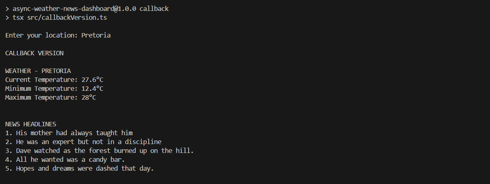
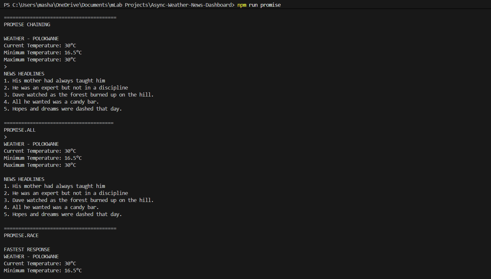
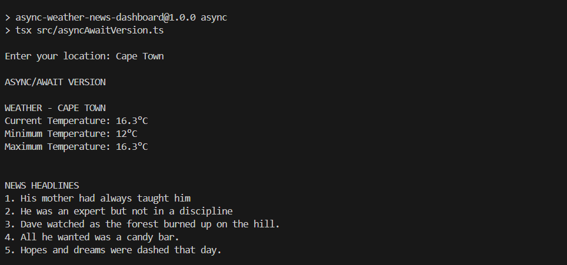

# Async Weather & News Dashboard

A Node.js and TypeScript project that demonstrates asynchronous programming using **Callbacks, Promises, and Async/Await**.

The application allows the user to enter a location in the terminal. It then finds the coordinates of that location, fetches weather information, and displays news/post headlines.

---

## Project Overview

The Async Weather & News Dashboard demonstrates how asynchronous operations can be handled using different approaches in TypeScript.

The same functionality is implemented using:

* Callbacks
* Promises
* Async/Await

The Promise version also demonstrates:

* Promise chaining
* `Promise.all()`
* `Promise.race()`

The project includes consistent error handling for failed API requests or invalid locations.

---

## Features

* Prompt the user to enter a location
* Convert the location into latitude and longitude
* Fetch weather data for the entered location
* Display the current temperature
* Display the minimum temperature
* Display the maximum temperature
* Fetch five post headlines
* Callback implementation
* Promise implementation
* Async/Await implementation
* Promise chaining
* `Promise.all()`
* `Promise.race()`
* Error handling
* TypeScript interfaces
* Readable terminal output

---

## Technologies Used

* Node.js
* TypeScript
* tsx
* Node.js HTTPS module
* Node.js Readline module
* Open-Meteo API
* Open-Meteo Geocoding API
* DummyJSON Posts API

---

## Screenshots

The following screenshots show the project outputs

## Callback Version


## Promise Version


## Async/Await Version



---

## How the Application Works

When the application starts, the user is asked to enter a location.

For example:

```text
Enter your location: Polokwane
```

The application then follows this process:

```text
User enters location
        ↓
Open-Meteo Geocoding API
        ↓
Latitude and Longitude
        ↓
Open-Meteo Weather API
        ↓
Weather Data
        ↓
DummyJSON Posts API
        ↓
News/Post Headlines
        ↓
Display Results
```

The geocoding API is needed because the weather API requires latitude and longitude coordinates.

---

# Getting Started

Follow the steps below to run the project after cloning it from GitHub.

## 1. Clone the Repository

Open a terminal and run:

```bash
git clone <your-repository-url>
```

Replace `<your-repository-url>` with the URL of this GitHub repository.

---

## 2. Navigate Into the Project

```bash
cd Async-Weather-News-Dashboard
```

---

## 3. Install Dependencies

Install the project dependencies:

```bash
npm install
```

This installs the packages listed in `package.json`, including TypeScript and tsx.

---

## 4. Run the Callback Version

Run:

```bash
npm run callback
```

The application will ask:

```text
Enter your location:
```

Enter a location, for example:

```text
Enter your location: Polokwane
```

The Callback version uses callback functions to handle the asynchronous operations.

The process is:

```text
Enter Location
      ↓
Find Coordinates
      ↓
Fetch Weather
      ↓
Fetch News
      ↓
Display Results
```

The nested callbacks also demonstrate how callback nesting can occur when asynchronous operations depend on one another.

---

## 5. Run the Promise Version

Run:

```bash
npm run promise
```

Then enter a location:

```text
Enter your location: Cape Town
```

The Promise version demonstrates:

* Promise chaining
* `Promise.all()`
* `Promise.race()`

### Promise Chaining

Promise chaining runs asynchronous operations in sequence.

```text
Location
   ↓
Weather
   ↓
News
   ↓
Display
```

### Promise.all()

`Promise.all()` starts the weather and news requests together and waits for both to complete.

### Promise.race()

`Promise.race()` starts both requests and returns whichever one settles first.

The fastest response can therefore be either the weather or the news.

---

## 6. Run the Async/Await Version

Run:

```bash
npm run async
```

Then enter a location:

```text
Enter your location: Durban
```

The Async/Await version uses `async` and `await` to make asynchronous code easier to read.

It also uses `try...catch` for error handling.

---

## NPM Commands

Command 
- `npm install` - Installs the project dependencies 
- `npm run callback` - Runs the Callback version    
- `npm run promise`- Runs the Promise version 
- `npm run async` - Runs the Async/Await version 

---

## Sample Callback Output

```text
Enter your location: Polokwane

CALLBACK VERSION

WEATHER - POLOKWANE
Current Temperature: 20.3°C
Minimum Temperature: 13.6°C
Maximum Temperature: 28°C

NEWS HEADLINES
1. His mother had always taught him
2. He was an expert but not in a discipline
3. Dave watched as the forest burned up on the hill.
4. All he wanted was a candy bar.
5. Hopes and dreams were dashed that day.

```

Weather values may change because the data is fetched from an external weather API.

---

## Sample Promise Output

```text
Enter your location: Polokwane
========================

PROMISE CHAINING

WEATHER - POLOKWANE
Current Temperature: 20.3°C
Minimum Temperature: 13.6°C
Maximum Temperature: 28°C

NEWS HEADLINES
1. His mother had always taught him
2. He was an expert but not in a discipline
3. Dave watched as the forest burned up on the hill.
4. All he wanted was a candy bar.
5. Hopes and dreams were dashed that day.

========================
PROMISE.ALL

WEATHER - POLOKWANE
Current Temperature: 20.3°C
Minimum Temperature: 13.6°C
Maximum Temperature: 28°C

NEWS HEADLINES
1. His mother had always taught him
2. He was an expert but not in a discipline
3. Dave watched as the forest burned up on the hill.
4. All he wanted was a candy bar.
5. Hopes and dreams were dashed that day.

========================
PROMISE.RACE

FASTEST RESPONSE
WEATHER - POLOKWANE
Current Temperature: 20.3°C
Minimum Temperature: 13.6°C
Maximum Temperature: 28°C

```

The `Promise.race()` result may change between runs because it returns whichever request settles first.

---

## Sample Async/Await Output

```text
Enter your location: Cape Town

ASYNC/AWAIT VERSION

WEATHER - CAPE TOWN
Current Temperature: 18.4°C
Minimum Temperature: 12.2°C
Maximum Temperature: 21.7°C

NEWS HEADLINES
1. His mother had always taught him
2. He was an expert but not in a discipline
3. Dave watched as the forest burned up on the hill.
4. All he wanted was a candy bar.
5. Hopes and dreams were dashed that day.

```

The temperatures shown above are sample values. Actual values depend on the weather returned by the API.

---

## TypeScript Types

The project contains:

```text
src/types.ts
```

This file defines TypeScript interfaces for the data returned by the APIs.

The types include:

* `Location`
* `GeocodingData`
* `WeatherData`
* `Post`
* `NewsData`

Using interfaces helps define the expected structure of the API responses and improves type safety.

---

## Error Handling

The project uses a shared error-handling function located in:

```text
src/errorHandler.ts
```

This keeps error messages consistent across the Callback, Promise, and Async/Await versions.

Examples include:

```text
Error: Location not found.
```

```text
Error: Failed to fetch location data.
```

```text
Error: Failed to fetch weather data.
```

```text
Error: Failed to fetch news data.
```

If the user does not enter a location, the application displays:

```text
Error: Please enter a location.
```

---

## APIs Used

### Open-Meteo Geocoding API

The Geocoding API converts the location entered by the user into latitude and longitude coordinates.

For example:

```text
Polokwane
    ↓
Latitude + Longitude
```

These coordinates are then passed to the weather API.

### Open-Meteo Weather API

The weather API retrieves weather information using the latitude and longitude returned by the Geocoding API.

The application displays:

* Current temperature
* Minimum temperature
* Maximum temperature

### DummyJSON Posts API

DummyJSON provides sample post data.

The application retrieves five post titles and displays them as headlines to demonstrate asynchronous API requests.

The titles are sample post data and should not be treated as live news.

---

## Learning Outcomes

Through this project, I learned how asynchronous programming works in Node.js and TypeScript.

### Callbacks

I learned how callbacks can be used to execute code after an asynchronous operation has completed.

I also learned how nested callbacks can become harder to read when several asynchronous operations depend on each other.

### Promises

I learned how Promises provide a cleaner way to manage asynchronous operations compared with deeply nested callbacks.

I learned how to use `.then()` to handle successful results and `.catch()` to handle errors.

### Promise.all()

I learned how `Promise.all()` can start multiple asynchronous operations together and wait for all of them to complete.

In this project, it is used to request weather and news data together.

### Promise.race()

I learned how `Promise.race()` starts multiple Promises and returns the result of whichever Promise settles first.

In this project, weather and news compete to return the fastest response.

### Async/Await

I learned how `async` and `await` provide a cleaner and more readable way to work with Promises.

I also learned how `try...catch` can be used to handle errors when using Async/Await.

### API Integration

I learned how data from one API can be used when making a request to another API.

For example:

```text
Location Name
     ↓
Geocoding API
     ↓
Coordinates
     ↓
Weather API
```

### TypeScript Interfaces

I learned how interfaces can describe the structure of API data and make TypeScript code easier to understand and maintain.

### Error Handling

I learned how to handle errors that can happen when:

* A location cannot be found
* An API request fails
* API data cannot be processed
* The user does not enter a location

---

## Author

GitHub: [Sharon-Mashai](https://github.com/Sharon-Mashai)
